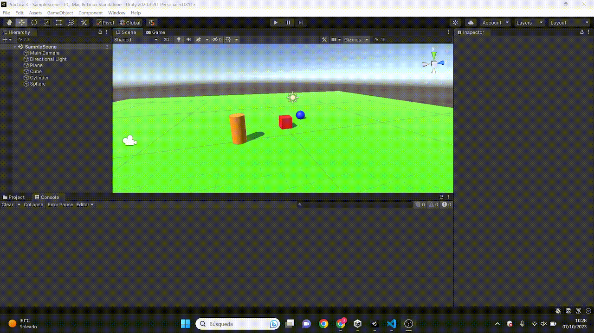
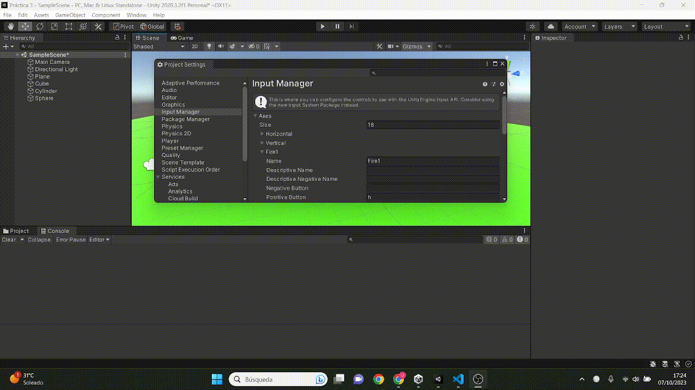
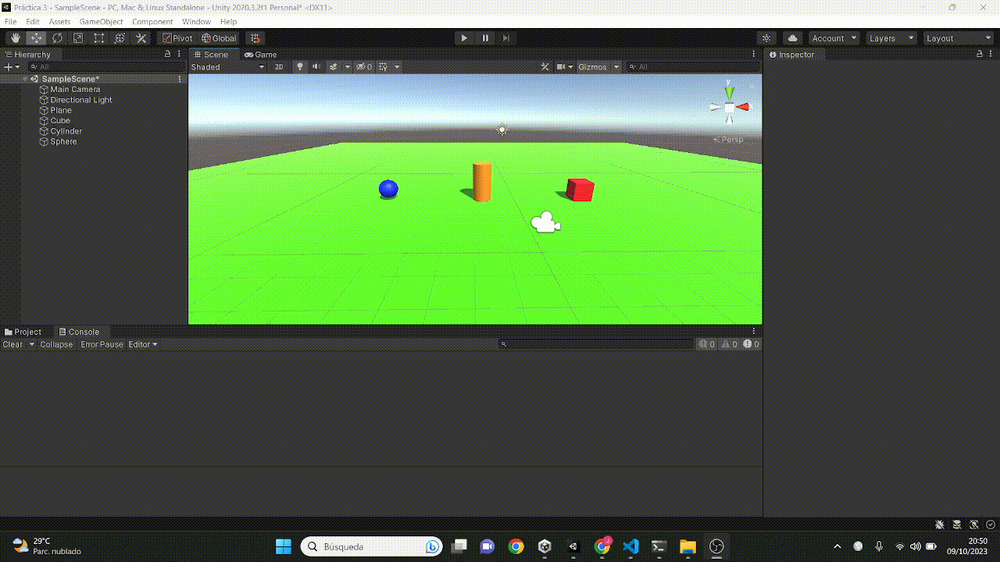
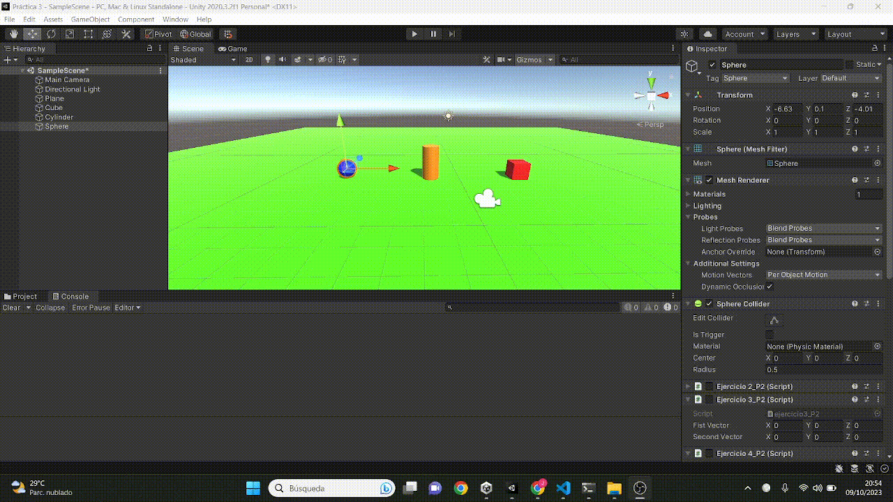
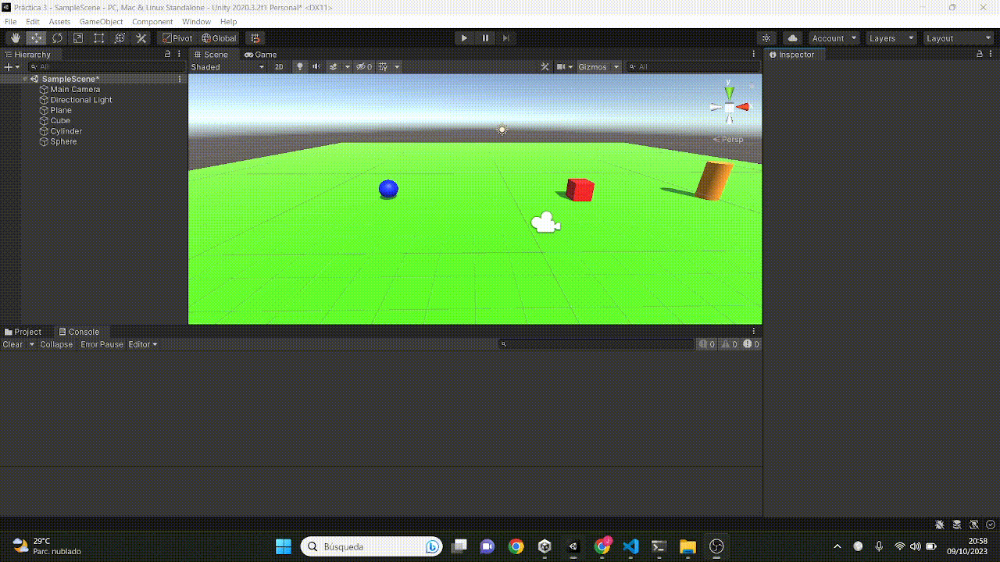
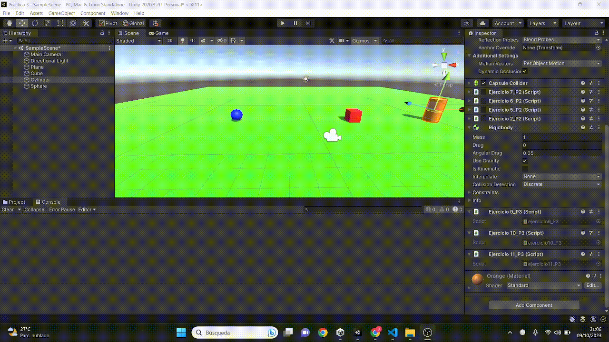
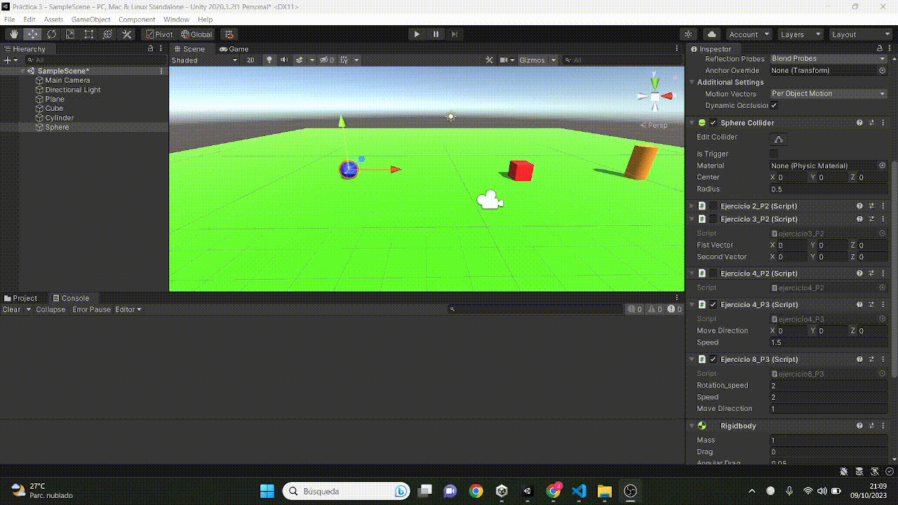
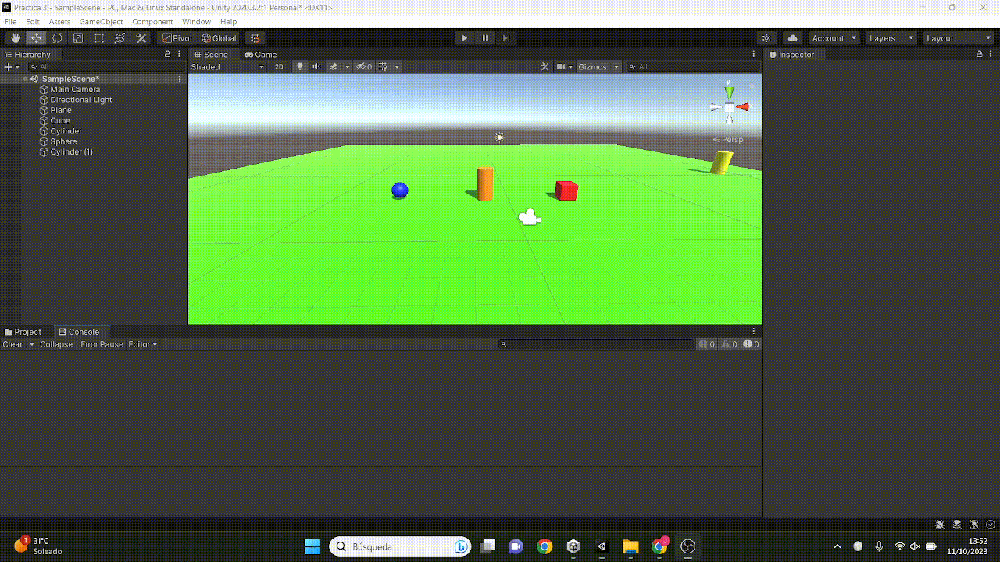
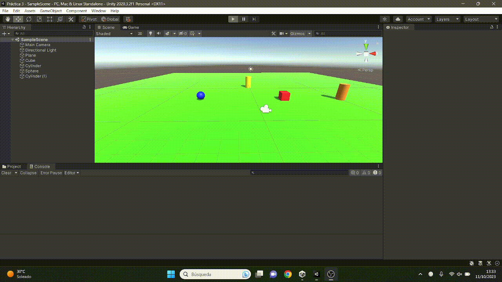

# II_2023_24_P3_Movimiento_Fisicas
## Introducción
El objetivo de esta práctica es el de poner en práctica lo aprendido respecto a la programación con físicas para Unity. A continuación adjunto los gifs que reflejan los ejercicios realizados.

## Gifs

Ejercicio 1

Ejercicio 2

Ejercicio 3

Ejercicio 4

Ejercicio 5

Ejercicio 6

Ejercicio 7

Ejercicio 8

Ejercicio 9

Ejercicio 10

Ejercicio 11

Ejercicio 12

